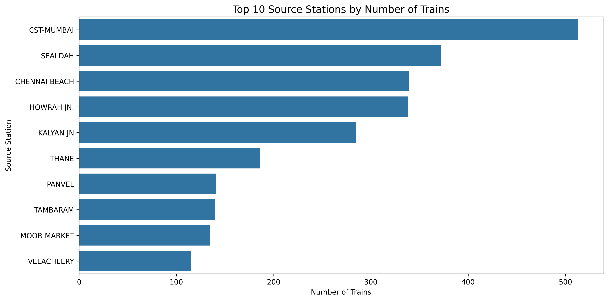

# 🚆 Railway Data Analytics

A comprehensive **Data Analytics** project that explores railway operational data using Python to perform data cleaning, exploratory data analysis (EDA), visualization, and generate actionable business insights.

The project demonstrates a complete analytics workflow, from loading and preprocessing raw data to uncovering operational trends and presenting insights through interactive visualizations and a detailed analytical report.

        

---

# 📌 Project Overview

The **Railway Data Analytics** project analyzes railway operational data to identify trends, patterns, and operational insights.

The analysis focuses on:

- Day-wise train operations
- High-traffic source stations
- High-traffic destination stations
- Weekday vs Weekend operations
- Frequently used train routes
- Distribution of train operations across stations

Using Python and popular data analytics libraries, the project transforms raw railway data into meaningful visualizations and business insights that support better operational planning and decision-making.

---

# 🎯 Objective

The primary objective of this project is to analyze railway operational data by:

- Loading and inspecting the dataset
- Cleaning and preprocessing the data
- Performing Exploratory Data Analysis (EDA)
- Creating meaningful visualizations
- Discovering operational trends and patterns
- Generating actionable business insights
- Presenting the analysis through a professional project report

---

# 🛠 Tools & Technologies

- Python
- Pandas
- NumPy
- Matplotlib
- Seaborn
- Jupyter Notebook

---

# 📂 Project Structure

```text
├── README.md
├── requirements.txt
│
├── Docs/
│   └── Railway Data Analytics Project Report.pdf
│
├── Notebook/
│   └── Railway Data Analytics.ipynb
│
├── Data/
│   └── Railway_info.csv
│
└── images/
    ├── 01_Distribution_of_Train_Operations_by_Day.png
    ├── 02_Top_10_Source_Stations_by_Number_of_Trains.png
    ├── 03_Top_10_Destination_Stations_by_Number_of_Trains.png
    ├── 04_Day-wise_Distribution_of_Train_Operations.png
    ├── 05_Weekday_vs_Weekend_Train_Operations.png
    ├── 06_Train_Frequency_Heatmap_(Day_vs_Day_Type).png
    ├── 07_Top_10_Most_Frequent_Train_Routes_(By_Source).png
    └── 08_Distribution_of_Train_Counts_Across_Source_Stations.png
```

---

# 📊 Key Analysis & Visualizations

The project includes the following analyses:

- Distribution of Train Operations by Day
- Top 10 Source Stations by Number of Trains
- Top 10 Destination Stations by Number of Trains
- Day-wise Distribution of Train Operations
- Weekday vs Weekend Train Operations
- Train Frequency Heatmap (Day vs Day Type)
- Top 10 Most Frequent Train Routes
- Distribution of Train Counts Across Source Stations

All visualizations were generated using **Matplotlib** and **Seaborn**.

---

# 📊 Sample Visualizations

## 1. Distribution of Train Operations by Day


---

## 2. Top 10 Source Stations by Number of Trains



---

## 3. Weekday vs Weekend Train Operations


---

## 4. Train Frequency Heatmap (Day vs Day Type)

.png)

---

## 5. Distribution of Train Counts Across Source Stations


---

# 🔍 Key Insights

- Friday records the highest number of train operations, indicating peak travel demand.
- Weekday train operations exceed weekend operations.
- A limited number of stations function as major railway hubs.
- Several routes consistently experience high train frequency.
- Weekend operations present opportunities for service expansion.
- Train operations are concentrated among a few key source stations.

---

# 💡 Business Recommendations

- Increase train frequency on high-demand routes during peak operational days.
- Optimize train schedules on lower-demand days to improve resource utilization.
- Expand weekend train services to accommodate leisure and tourist travel.
- Prioritize infrastructure improvements at high-traffic railway stations.
- Use operational trends to support future route planning and scheduling decisions.

---

# 📄 Project Report

The repository includes a detailed project report covering:

- Executive Summary
- Dataset Description
- Data Cleaning & Preprocessing
- Exploratory Data Analysis (EDA)
- Data Visualizations
- Key Insights
- Business Recommendations
- Conclusion

---

# ▶️ How to Run the Project

### Clone the repository

```bash
git clone https://github.com/Harsh-Belekar/Railway-Data-Analytics.git
```

### Navigate to the project directory

```bash
cd Railway-Data-Analytics
```

### Install dependencies

```bash
pip install -r requirements.txt
```

### Launch Jupyter Notebook

```bash
jupyter notebook "Railway Data Analytics.ipynb"
```

---

## 🧑‍💻 Author

**👤 Harsh Belekar**  
📍 Data Analyst | Python | SQL | Power BI | Excel | Data Visualization  
📬 [LinkedIn](https://www.linkedin.com/in/harshbelekar) | 🔗[GitHub](https://github.com/Harsh-Belekar)

📧 [harshbelekar74@gmail.com](mailto:harshbelekar74@gmail.com)

---

⭐ *If you found this project helpful, feel free to star the repo and connect with me for collaboration!*
